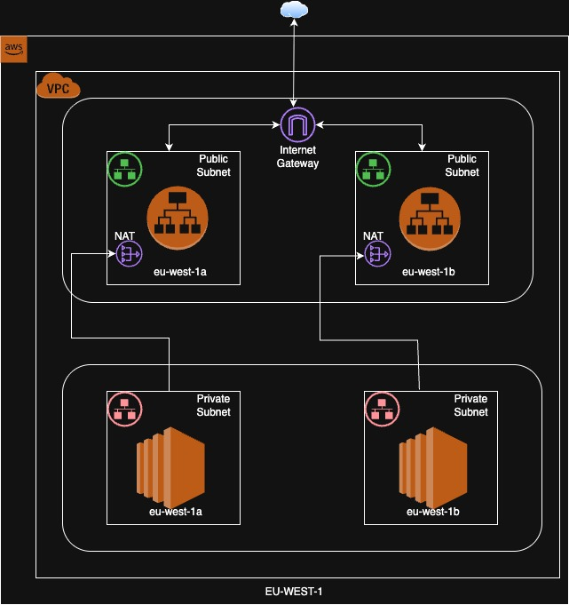
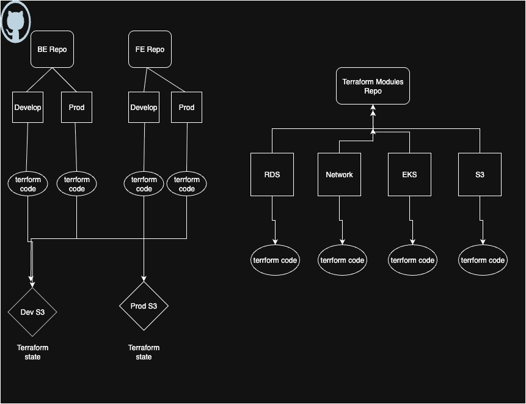

# Appical Plan

## Description
This repository describes the complete setup of the Ruby monolith application we want to deploy on AWS (preferably on EKS, but can be extended to any container orchestration tool). The topics we want to cover are mentioned below as separate headings, and then the plan for each is explained within them in the form of diagrams, screenshots, and bullet points. There are some assumptions made and some decisions taken which would also be mentioned at the end of the README.

## Available Information:

```
Database: PostgresSQL
Backend: Ruby on Rails Monolith
Frontend: A few react apps
Mobile: 2 native apps
Integrations: Self hosted middelware
Runtime: Docker, running on VM's
CI/CD: GH Actions & Circle CI
Observability: basic metrics/logs, some stuff in Sentry & AppSignal, no
standardisation, no unified analytics tool.
```

### Descisions

**EKS**: I chose to go with EKS, as the applications are dockerized and Kubernetes is a great container orchestration tool. As the application is a monolith, we could also choose ECS, but with so many open-source tools (Helm, Karpenter, AWS Load Balancer Controller, External Secrets, External DNS, and many more) out there that make Kubernetes so feature-rich, in the future, in case of huge growth, being on EKS will make scaling very easy.

**AWS**: I chose AWS as it is one of the leading cloud providers and has great services and a huge community.

**RDS PostgresSQL** - I chose a managed RDS instance as deploying a self-managed database and maintaining it is very difficult and a little outdated now. With powerful and cheap machines (Graviton), it's very easy to use a managed database.

**Github**: I chose GH for CI/CD as it provides great flexibility. Any CI/CD tool can do the job; some of the big players now are GH and GitLab.

**Datadog**: As explained below, I chose Datadog as it provides a huge number of features out of the box. If set up correctly, the cost can be controlled. Usually, Datadog is known to be expensive; the choice is between saving cost or avoiding toil.

**Terraform** - I chose Terraform for IAC because this is one of the most powerful and cloud-agnostic tools. Extremely flexible and can be integrated easily with other applications, with again a huge community.

### Assumptions

- I have assumed the capacity of the resources. I have proposed the solutions based on normal traffic for an application; nonetheless, we have tools like Karpenter and Horizontal Pod Autoscalers to help us with scaling in EKS.
- I have explicitly not mentioned any backup strategies, but for any distributed system, that is essential, and AWS comes with many strategies for it.
- All the solutions provided are suggested keeping security in mind; best practices of security are part of this setup. I can answer any questions around them if required.
- The self-hosted middleware (caches, queues, etc.) I did not elaborate on, but these could again be deployed in the EKS clusters via Helm charts or as Terraform modules.
- Access management is not part of the solution but is an important component to keep in mind.
- VPN setup has not been discussed here, but access to private resources like DBs and EKS clusters should be over a VPN.
- DNS has not been discussed here, but a standard tool like Route 53 can be used to route traffic to the applications.


### Environments

For the sake of simplicity, I would have 2 environments: Develop and Production. These environments will essentially be 2 different AWS accounts to maintain isolation from each other. Both the environments will be identical as much as possible, except for resources; sizing of compute components will be different. But the base layer of both the environments would be identical.

As you can see in the architecture diagram below, this showcases the base network setup.

- 1 non-default VPC in the eu-west-1 region within each AWS account, denoting the VPCs of each environment.
- 2 public subnets and 2 private subnets in the 2 availability zones (eu-west-1a, eu-west-1b).
- Our EKS clusters would be deployed in the private subnets and will not be public, keeping them secure.
- The database would also be deployed in the private subnets, which prevents exposure to the internet. We could also go a step further and deploy the databases in private subnets of their own. This increases the complexity a little as there would need to be communication between the application and database, and there could be some minimal latency.
- NAT gateways in the public subnets for the resources in the private subnets to be able to get upgrades and patches from the internet.
- Load balancers deployed in the public subnets for traffic flow in and out of the applications.




### Infrastructure-as-Code.

I would be choosing Terraform as the preferred IAC tool to provision our infrastructure and manage it further. I would be making use of Terraform modules to provision services or resources required by the application to function, for example, Databases, S3 buckets, CloudFront distributions.

- In a separate GitHub repository, I would create Terraform modules for each infrastructure component that is required (base-networking, EKS, RDS, S3, secrets, etc.). The modules can be re-used and called by the application (FE, BE) repositories to provision resources needed.
- In the repository structure diagram below, I show the basic structure of how the Terraform modules would look. Every component that would be re-used by multiple teams would be managed via Terraform modules. These modules avoid repeating code for provisioning a resource multiple times.
- In the application repos (BE or FE), there would be the Terraform code that calls these modules to create the resources. They are separated in dedicated folders for each environment, which lets us manage them separately and reduces chances of interactions.
- Terraform stores everything in something called state files, which stores information about the resources it manages. In our case, we store them in the respective AWS accounts for each environment.

Also adding some sample Terraform code to help you understand a little better.




### CI/CD design

I would be using GitHub Actions as my CI/CD tool in this case. Below are the points on how the setup and flow would look, also considering the simple branching strategy.

- The best way to deploy to Kubernetes is to use Helm charts. Creating a Helm template with components required for the application (deployment, service, ingress, etc.).
- We will be deploying our applications, which are already dockerized, via Helm and Terraform in combination with GH workflows.
- The simple stages in the workflow would involve:
    ```
    building the docker image
    tagging the docker image
    pushing the docker image to ECR
    running a terraform plan (checks changes that need to be deployed)
    running a terraform apply (deploying the changes)

    ```
- There would be a single workflow that will be able to deploy to both prod and dev using the environments feature in GitHub. Using this, we can set up secrets and variables per environment, and they can be parsed in the workflows as variables.
- One important point to remember: as we are deploying to EKS and our clusters are private, we would be deploying to them using GitHub Private Runners (not included in the scope here).
- As you can see in the simple flow of deployment to production, with a single source of truth main branch:

**FE:**
- Built in CI (GitHub Actions) → optimized static bundle (JS/CSS/HTML)
- Uploaded to S3 bucket per environment (staging, production)
- CloudFront in front of S3 for global edge caching

**Mobile:**
- Built in CI (Fastlane pipelines triggered by GitHub Actions)
- Unit & UI tests in CI
- Build artifacts pushed to mobile testers

Note: Adding a sample workflow to show how it would look, mainly for BE, as FE and mobile will be slightly different.


### Observability

As mentioned in the question, there are 2 tools being used at the moment, and there seems to be a lack of a proper observability setup. I would choose one monitoring tool that can help us here; the favorite choices would be Datadog or Grafana in combination with some more open-source tools (Prometheus, Loki, Alertmanager, and Thanos). For simplicity and assuming we have a lot of budget, I will choose Datadog. Datadog is a one-stop shop for all observability needs.

- In our EKS clusters, we deploy the Datadog agents, which collect metrics and logs from our applications in the EKS cluster and ship them to Datadog.  
- These agents send logs and metrics about our applications, infrastructure, and supporting resources.  
- Datadog captures logs, APM traces, database monitoring, query metrics, and audit logs.  
- We create dashboards and monitors that send alerts if services go down, based on thresholds we set.  
- We set up monitors for major endpoints and create alerts or pages if they go down.  
- Metrics that I monitor:  
    ```
    Number of requests to the application  
    HTTP error codes  
    Application latency  
    RUM (Real User Monitoring) with something like Datadog RUM  
    Throughput  
    Error rate  
    Memory usage  
    CPU usage  
    Slow queries  
    Database connections  
    Basic Kubernetes monitoring dashboards (failing pods, resource usage by individual applications)  
    ```  

**Note:** Grafana, in combination with a few other tools, can also do all the things Datadog can, but it is difficult to set up and maintain. While compute costs may be low, it will require significant man-hours.  

### QA Automation & Quality Gates

- **Pre-deploy:** run e2e suite against the staging namespace before Helm upgrade to production.  
- **Deploy:** progressive rollout using Helm.  
- **Post-deploy:** smoke tests on production pods after rollout completes.  
- **Quality gates:** block promotion if:  
    - Any pre-deploy tests fail  
    - Error rate or latency exceeds SLO during rollout  
    - New pods fail readiness/liveness probes  

A basic flow could look like this:

```
Run unit tests (Rails, React)
Deploy to staging namespace via Helm
Wait for all pods to pass readiness probes
Run e2e tests (Playwright) against staging ingress
On production rollout, run synthetic checks for error rate & latency
Fail/rollback if pod health drops below threshold
After 100% rollout, run smoke tests in all AZs against production ingress
```

## Main KPIs, Biggest Risks & Trade-offs

**KPIs:**  
**Lead Time:**  
- With the above setup, in a perfect scenario, we should be able to deploy to production from a developer’s Mac in less than an hour.  

**Deployment Frequency:**  
- This setup makes it possible to deploy to production every day with small changes, keeping testing time minimal, as the deployment process is one click.  

**Change Failure Rate:**  
- The possibility of deploying code with errors is almost zero, as Helm does a rolling deploy. Until the new deployed version becomes healthy, the old version continues receiving traffic. Rollback can happen if incorrect features are shipped. I do not expect more than 2–3 deployment failures per month.  

**Mean Time to Restore:**  
- With proper alerting and smoke tests, detecting issues and failures is straightforward. Once a decision is made to rollback, Helm can revert a release with a single command. Rollback should take 30 minutes or less.  

**Risks:**  
If the following points are properly addressed, risks will be minimal:  

- Encryption at rest and in transit of traffic and data  
- Proper secret management at all levels  
- Security checks in workflows before code is merged  
- Pre-commit hooks to avoid bad code pushes  
- Maintaining proper audit trails of actions by humans and applications  
- Vulnerability scans of public and private images  
- Regular upgrades and patching of applications and servers  
- Following least privilege access for humans and applications  
- Adequate authentication and authorization for APIs and applications  
- Implementing WAF rules to safeguard APIs and endpoints  

**Trade-offs:**  
- Complexity of using EKS for developers and the associated learning curve  
- Helm provider for Terraform can sometimes be buggy  
- Heavy reliance on AWS  
- Datadog can get expensive if not monitored  
- GitHub private runners need maintenance since they are self-hosted


**PS:** ChatGPT was used in this assessment to only format and spell check, and topics around QA and mobile deployment. 
